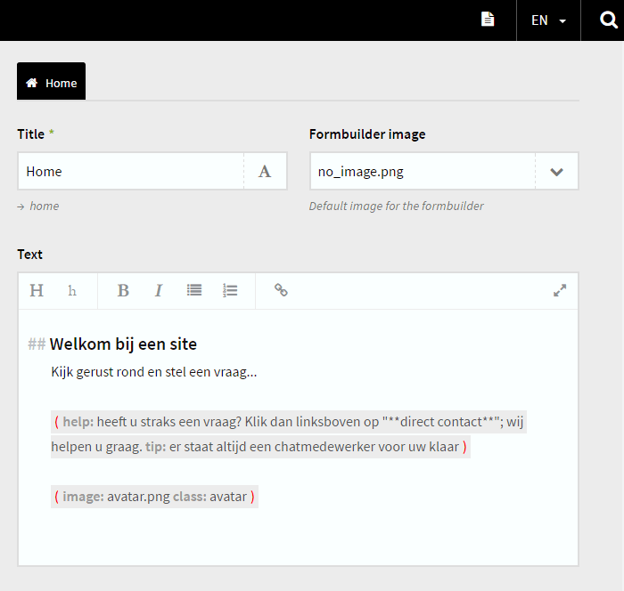

# Kirby - Jumplist

#### Version 1.0.0 - 2016-04-16
- Initial Public Offering...

****

### What is it?

Kirby Jumplist adds a menu in the upper-right corner of Kirby's panel, allowing you to quickly jump from page to (sub-)page - thus allowing you to change, edit, copy / paste very quicly between pages.

More info about Kirby can be found at http://getkirby.com

##Installation##

- Download the .zip and extract it to the root of your site.
- The jumplist acts as a field, simply add it to every blueprint where you want the jumplist to show up.
- See ```\site\blueprints\jumplist_example.php``` for the basic set-up.
- At default the list shows a maximum of 10 pages per row. You can change this number in ```\site\config\config.php```.
- At default the list shows submenu's for every page. You can change this behaviour in ```\site\config\config.php```.
- See ```\site\config\config_example.php``` for the setup of those preferences.

****



*Version 1.0.0*